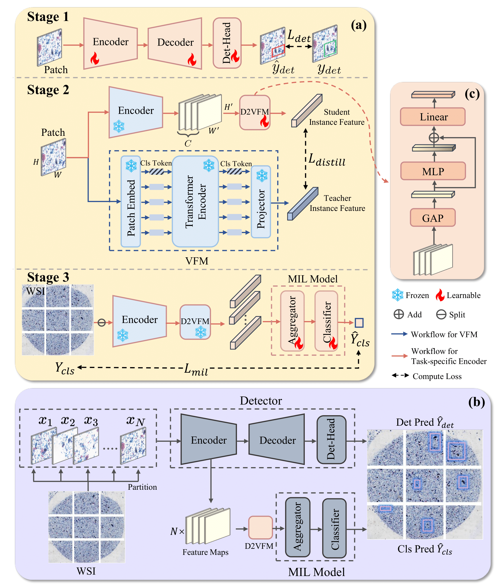

# TS2G-KD
Official repository of  **Leveraging Task-Specific to General Knowledge Distillation for Efficient Cervical Cancer Screening on Cytological Whole Slide Images**.



## Installation

We recommend you to create two separate environments, one for detection and distillation, and another for MIL classification.

* For detection and distillation, follow [Deformable DETR](https://github.com/fundamentalvision/Deformable-DETR) official repository:

  ```shell
  # for example
  conda create -n deformable_detr python=3.7
  conda activate deformable_detr
  
  pip install torch==1.9.0+cu111 torchvision==0.10.0+cu111 torchaudio==0.9.0 -f https://download.pytorch.org/whl/torch_stable.html
  
  cd Detection_and_KD
  pip install -r requirements.txt
  
  #Compiling CUDA operators
  cd ./models/ops
  sh ./make.sh
  # unit test (should see all checking is True)
  python test.py
  ```

* For MIL classification:

  ```shell
  # for example
  conda create -n mil python=3.8
  conda activate mil
  
  conda install pytorch==1.12.1 torchvision==0.13.1 torchaudio==0.12.1 cudatoolkit=11.3 -c pytorch
  pip install jupyter
  pip install open-clip-torch transformers matplotlib
  pip install scikit-learn==0.22.1 future==0.18.3
  pip install wandb==0.15 torchsummary==1.5.1 torchmetrics
  pip install einops chardet omegaconf h5py 
  pip install pandas openpyxl
  ```

## Preprocessing: Utilizing VFM to Extract Instance Features

```shell
cd Patch encoder

bash ../tools/preprocess/extract-features.sh
```

## Training

### Stage 1: Lesion detector training

By default, we train a Deformable DETR that uses ResNet-50 as its backbone.  See [Deformable DETR](https://github.com/fundamentalvision/Deformable-DETR) official repository for more informations.

After training the detector, we recommend saving the model weights of its backbone, which is a ResNet-50, to facilitate the Stage 2 training .

### Stage 2: D2VFM training

* **Dataset preparation.** We train a Mean-MIL model on the CSD dataset utilizing different VFMs as instance feature extractors. We then infer the scores for each patch and selected the top 50 patches from each WSI in the CSD training subset, along with the features extracted by VFM, to construct the dataset.

  ```shell
  cd MIL
  conda activate mil
  
  bash ../tools/preprocess/filter.sh
  ```

  The organization of the dataset is structured as follows:

  ```
  dataset_root/
  ├── wsi_root/
      ├── wsi-1/
          ├── patch1.jpg
          ├── patch1.pt
                  ...
          ├── patch50.jpg
          └── patch50.pt
      ├── wsi-2/
          ├── patch1.jpg
          ├── patch1.pt
                  ...
          ├── patch50.jpg
          └── patch50.pt
          ...
      └── wsi-N/
          ├── patch1.jpg
          ├── patch1.pt
                  ...
          ├── patch50.jpg
          └── patch50.pt
  
  └── ann_root/
  	└── ann.json
  ```

* **Model training.** We load the backbone weights of lesion detector trained in Stage 1 and freeze them, training only the D2VFM module. 

  ```shell
  cd Detection_and_KD
  conda activate deformable_detr
  
  bash ../tools/distill.sh
  ```

### Stage 3: MIL module training

* **Utilizing ResNet-50 and D2VFM to extract instance features.**

  ```shell
  cd Detection_and_KD
  conda activate deformable_detr
  
  bash ../tools/r50_extract.sh
  ```

* **Model training.** 

  ```shell
  cd MIL
  conda activate mil
  
  bash ../tools/mil_benchmark.sh
  ```
